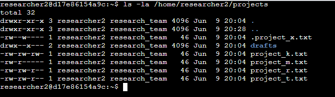
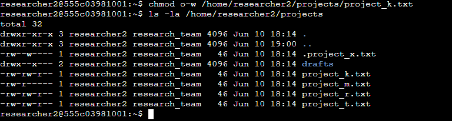
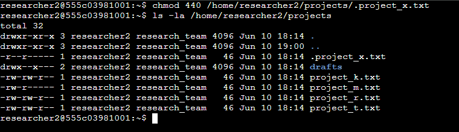
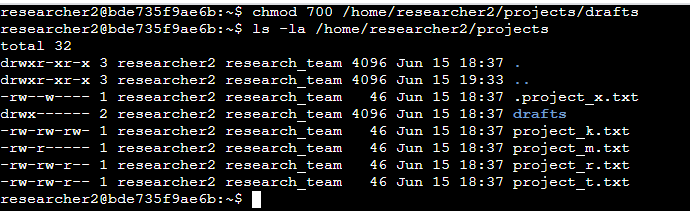

# 🛡️ File Permissions in Linux

## 📘 Project Description

In this scenario, I worked as a security professional responsible for managing file system permissions on a Linux machine used by a research team. My task involved checking current file and directory permissions, interpreting those permissions, and modifying them to ensure only authorized users had the correct access. This included managing hidden files, removing unauthorized access for “others,” and securing a sensitive directory.

---

## 🔍 Check File and Directory Details

To check file and directory permissions, I used the following command:

```bash
ls -la /home/researcher2/projects
```

The output of the command was the following:



### 🧾 Describe the Permission String

Example: -rw-rw-r-- (for project_t.txt)

This 10-character string shows the type of file and its permissions:

- (-) — regular file (d for directory)
- rw- — User has read and write permissions
- rw- — Group has read and write permissions
- r-- — Others have read-only access

So, project_t.txt is readable and writable by the user and group, and readable by others.

### ✏️ Change File Permissions

File: project_k.txt <br>
Issue: File had world-writable access (-rw-rw-rw-), which is not secure.

Command used:

```bash
chmod o-w /home/researcher2/projects/project_k.txt
```

The output of the command was the following:



- New permissions: -rw-rw-r--
- Write access was removed from others, ensuring only the user and group can modify the file.

### 👁️ Change File Permissions on a Hidden File

File: .project_x.txt <br>
Issue: Hidden file had write access with no read access — not ideal for sensitive data.

Command used:

```bash
chmod 440 /home/researcher2/projects/.project_x.txt
```

The output of the command was the following:



- New permissions: -r--r-----
- Now only the user and group have read-only access. No access is given to others.

### 📁 Change Directory Permissions

Directory: drafts/ <br>
Issue: Directory was executable by others, posing a potential risk.

Command used:

```bash
chmod 700 /home/researcher2/projects/drafts
```

The output of the command was the following:



- New permissions: drwx------
- Only the owner has read, write, and execute permissions. Group and others have no access.

## ✅ Summary

In this task, I:

- Reviewed and updated Linux file permissions using chmod
- Removed unauthorized write access for public files
- Locked down hidden files with read-only restrictions
- Restricted a directory to be accessible only by its owner

These changes will help maintain file confidentiality and ensure compliance with organizational security policies on multi-user Linux systems.

**[View Full Report on Google Docs](https://docs.google.com/document/d/1rWygd4CDuNllrm_A5tiY-r_CkiYetMoAZwS1xJEL0sU/edit?usp=sharing)**
